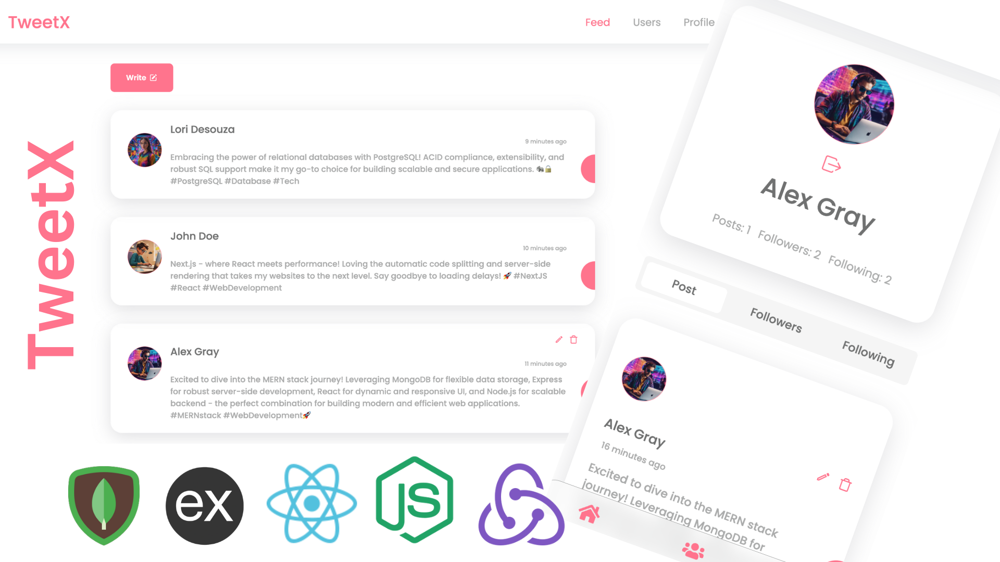

# Tweetx - A MERN Stack Application

Tweetx is a comprehensive full-stack MERN (MongoDB, Express.js, React, Node.js) application designed to empower users in expressing and sharing their thoughts seamlessly. The platform incorporates robust user authentication through JWT, facilitating secure post creation, user following functionality, and dynamic data fetching powered by Redux Toolkit Query. Offering a dynamic and engaging social experience, Tweetx aims to foster meaningful connections through its feature-rich environment.

## Features

- **User Authentication:** Users can register and log in securely using JWT authentication.
- **Post Creation:** Authenticated users can create and share their thoughts through posts.
- **Follow Users:** Users have the ability to follow other users to see their posts and profile information.
- **Dynamic Data Fetching:** Redux Toolkit Query is used to dynamically fetch data from the backend and auto-refetch as needed.
- **State Management:** Redux is utilized for managing application-level states.

## Technologies Used

- **MongoDB:** Database for storing user information, posts, and other data.
- **Express.js:** Backend framework for handling HTTP requests, authentication, and routes.
- **React:** Frontend library for building a dynamic user interface.
- **Node.js:** Server-side runtime environment for running the application.
- **JWT (JSON Web Token):** Token-based authentication for securing user sessions.
- **Redux Toolkit Query:** For dynamic data fetching and auto-refetch capabilities.
- **Redux:** State management for handling application-level states.
- **Mongoose:** MongoDB object modeling library for Node.js.

## Usage

1. Register or log in with your credentials.
2. Create posts to share your thoughts.
3. Follow other users to see their posts and profile information.

## Contributing

If you would like to contribute to this project, feel free to submit issues or pull requests.

## Conclusion

Tweetx represents a dynamic and feature-rich MERN stack application designed to provide users with a platform to express their thoughts and connect with others. With robust user authentication using JWT, secure post creation, and the ability to follow other users, Tweetx aims to create a seamless and engaging social experience.The project leverages modern technologies such as Redux Toolkit Query for efficient data fetching and auto-refetch capabilities, while Redux handles application-level state management. The backend, built with Node.js and Express, is powered by Mongoose for MongoDB database handling. As this project continues to evolve, we welcome contributions from the community. Whether it's reporting issues, suggesting new features, or submitting pull requests, your input is valuable in enhancing the overall functionality and user experience of Tweetx.Thank you for exploring Tweetx, and we look forward to seeing how this platform grows and fosters meaningful connections in the online community.
